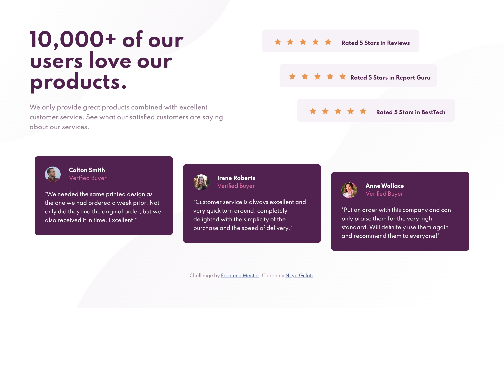

# Frontend Mentor - Social Proof Section solution

This is a solution to the [Social Proof Section challenge on Frontend Mentor](https://www.frontendmentor.io/challenges/social-proof-section-6e0qTv_bA). Frontend Mentor challenges help you improve your coding skills by building realistic projects. 

## Table of contents

- [Overview](#overview)
  - [The challenge](#the-challenge)
  - [Screenshot](#screenshot)
  - [Links](#links)
- [My process](#my-process)
  - [Built with](#built-with)
- [Author](#author)
- [Project Setup](#project-setup)


## Overview

### The challenge

Users should be able to:

- View the optimal layout for the site depending on their device's screen size
- See hover states for all interactive elements on the page
- Filter job listings based on the categories

### Screenshot



### Links

- Solution URL: [Frontend Mentor](https://www.frontendmentor.io/solutions/social-proof-section-vuejs-N1OVhaqCz)
- Live Site URL: [Social Proof Section](https://nityagulati.github.io/social-proof-section/)

## My process

### Built with

- [Vue.js](https://vuejs.org)
- SCSS
- Flexbox
- Mobile-first workflow

## Author

- Website - [Nitya Gulati](https://www.nityagulati.com)
- Frontend Mentor - [@nityagulati](https://www.frontendmentor.io/profile/nityagulati)

## Project setup
```
npm install
```

### Compiles and hot-reloads for development
```
npm run serve
```

### Compiles and minifies for production
```
npm run build
```

### Lints and fixes files
```
npm run lint
```

### Customize configuration
See [Configuration Reference](https://cli.vuejs.org/config/).
